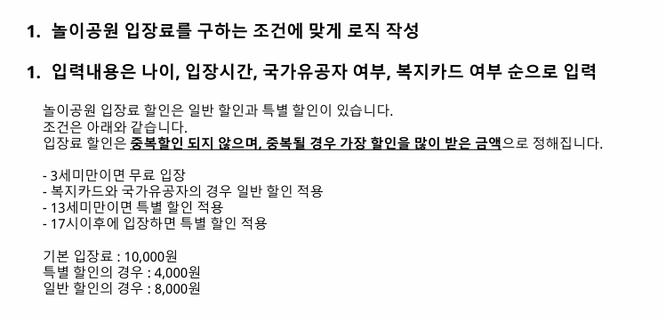
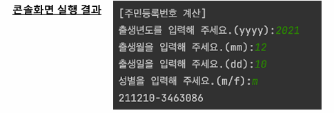
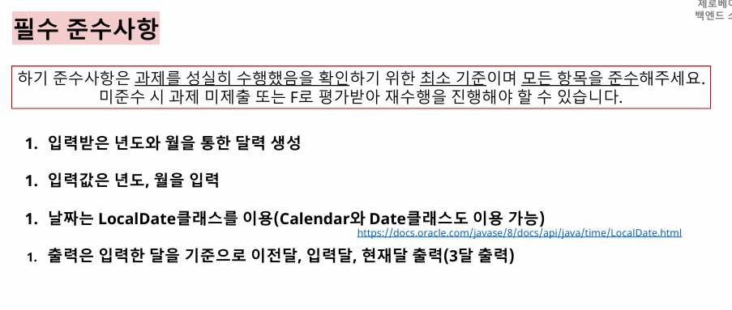

# 과제 1 구구단 출력하기
- 수행목적 : JAVA의 다중반복문과 format함수를 이용하여 주어진 조건에 맞는 로직 작성
- 간략소개 : 반복문의 기본을 학습하는 진부하면서도 고전프로그램인 구구단을 화면에 출력
하는 프로그램을 작성해주세요  

예시

첫번째 줄에 1~9단의 첫줄이 출력되며
순차적으로 다음 숫자가 출력되게 만든다.

2중for문을 활용하면 간단하게 작성할 수 있다.
```java
 public static void main(String[] args) {
System.out.println("[구구단 출력]");
for (int i = 1; i <= 9; i++) {
    for (int j = 1; j <= 9; j++) { //1단부터 9단까지 줄수는 9개
        System.out.printf("%02d X %02d = %02d     ", i, j, i * j);
        }//%d는 10진수 format으로 %와d사이에 숫자를 너으면 해당 단어의 간격을 정할 수 있고 0을 넣으면 단어외의 빈자리를 0으로 채워준다. 0x X 0x = n의 형싱을 취하고있으므로 %02d를 사용하도록 한다
        System.out.println(" "); //두번째 for문 즉 첫번째 줄 출력후에 한줄 띄어준다.
        }
    }
}
```

성공적

# 과제 2 결제 금액 캐시백 계산 프로그램
-  수행목적 : Scanner의 입력함수와 조건문을 통한 캐시백 계산 로직 작성
- 간략소개 : 직불카드로 결제를 하게되면 이에 대한 캐시백을 제공해줍니다.    
주어진 캐시백 금액을 계산하는 프로그램을 작성해보세요.


```java
import java.util.Scanner;

public class notepad2 {
    public static void main(String[] args) {
        Scanner sc = new Scanner(System.in);
        System.out.println("[캐시백 계산]");
        System.out.print("결제 금액을 입력해 주세요.(금액):");
        int cash = sc.nextInt(); //입력받은 숫자를 금액에 대입
        int cashback = (cash/10); // 우선 금액의 10퍼센트다.
        cashback=Math.round((cashback/100)*100);//round는 반올림 매서드로 만약 cash가 1200원이라면 1.2가 됐다가 0.2를 버리고 1에 100을 곱해서 100이 cashback이 되는 방식 
        if(cashback>300) cashback=300; // cashback의 최대치는 300원이다.
        System.out.println("결제 금액은 "+cash+"원이고, 캐시백은 "+cashback+"원 입니다.");
    }
}
```
round 함수를 배워 지식이 늘었다.


문제없이 출력된다.

# 과제 3 놀이동산 입장권 계산 프로그램
- 수행목적 : Scanner의 입력함수와 다중조건문을 통한 입장권 계산 로직 작성
- 간략소개 : 놀이동산의 입장권은 나이와 기타 우대사항에 따라 입장료가 달라집니다.
 문제에 서 주어진 조건에 맞는 입장료를 구하는 프로그램을 작성해보세요.




if문과 else if문, 논리연산자가 필요한 과제이다.
```java
 Scanner sc = new Scanner(System.in);
        int price = 10000;
        System.out.println("[입장권 계산]");
        System.out.print("나이를 입력해 주세요.(숫자):");
        int age = sc.nextInt();
        System.out.print("입장시간을 일력해 주세요.(숫자입력):");
        int time = sc.nextInt();
        sc.nextLine(); //엔터친거 씹어줄 라인
        System.out.print("국가유공자 여부를 입력해 주세요.(y/n):");
        String army = sc.nextLine();
        System.out.print("복지카드 여부를 입력해 주세요.(y/n):");
        String card = sc.nextLine();
```
여기까지는 보이는대로 써도 지장이 없다. 딱히 조건식이 필요한게 아니어서서
```java
if (age < 3) {
            price = 0; //3살 미만 무료
        } else if (age<13 || time>=17) { // 13살 미만이거나(or) 17시 이후 입장시 4000원
            price = 4000;
        } else if (army.equals("y") || card.equals("y")) { //국가유공자이거나(or)복지카드가 있으면 8000원
            price = 8000;
        }
        System.out.println("입장료: "+price);
```
else if를 이용하여 조건에 맞는 식을 구현해준다. 이때 army와 card를 string으로 했기 때문에 '=='이 아니라 .equals로 비교해주는게 맞다.


# 과제 4 주민등록번호 생성 프로그램
- 수행목적 :  Scanner의 입력함수와 조건문 및 Random 클래스를 통한 주민번호 생성로직작성
- 간략소개 :  주민번호는 출생년도와 출생월과 성별에 대한 내용을 포함하여 만들어지는 숫자로 된 체계 입니다.   
이에 2020년도부터 생성조건이 변경되었습니다.
이를 조건에 맞게 생성하
는 프로그램을 작성해보세요.
- 입력값은 2020년도 이후로 입력한다는 전제로 작성해주세요.




풀이
```java
import java.util.Random;
import java.util.Scanner;

public class notepad2 {
    public static void main(String[] args) {
        Scanner sc = new Scanner(System.in);
        System.out.println("[주민등록번호 계산]");
        System.out.print("출생년도를 입력해 주세요.(yyyy): ");
        int year = sc.nextInt();

        System.out.print("출생월을 입력해 주세요.(mm): ");
        int month = sc.nextInt();

        System.out.print("출생일을 입력하세요: ");
        int day = sc.nextInt();
        sc.nextLine();

        System.out.print("성별을 입력해 주세요.(m/f): ");
        String gender = sc.nextLine();
```
우선은 보이는 부분을 입력받았다.  
이제 이 입력받은 정보를 토대로 주민번호를 생성하도록 작성해보자
```java
String yearstr = String.valueOf(year % 1000); //String타입으로 입력받는게 나중에 합쳐서 출력하기 편하다. year을 100으로 나누면 나머지는 뒤에 두자리만 남게 되고 이것을 String으로 변환시켜서 저장해준다
String monthstr = String.format("%02d", month);
        String daystr = String.format("%02d", day);
        //마찬가지로 달과 일도 입력받는데 이때 한자리수 일수도 있기때문에 format을 이용해서 2자리로 각각 변환하여 저장해준다.
int gendercode = 0;
        if (gender.equals("m")) {
            gendercode = 3;
        } else {
            gendercode = 4;
        }
        //성별에 따라 3이나 4가 나오게 세팅
        Random random = new Random();
        int randomNum = random.nextInt((999998)+1); // 랜덤의 nextInt는 0부터 n까지의 숫잔데 우리는 1부터 99999까지 필요하기때문에 999998+1로 맞춰준다. 그러면 1부터 999999까지.
System.out.println(yearstr + monthstr + daystr + " - " + gendercode + randomNum);
//최종적으로 양식에 맞게 출력되게끔 한다.
```
## 최종코드
```java
import java.util.Random;
import java.util.Scanner;

public class notepad2 {
    public static void main(String[] args) {
        Scanner sc = new Scanner(System.in);
        System.out.println("[주민등록번호 계산]");
        System.out.print("출생년도를 입력해 주세요.(yyyy): ");
        int year = sc.nextInt();

        System.out.print("출생월을 입력해 주세요.(mm): ");
        int month = sc.nextInt();

        System.out.print("출생일을 입력하세요: ");
        int day = sc.nextInt();
        sc.nextLine();

        System.out.print("성별을 입력해 주세요.(m/f): ");
        String gender = sc.nextLine();

        String yearstr = String.valueOf(year % 100);
        String monthstr = String.format("%02d", month);
        String daystr = String.format("%02d", day);

        int gendercode = 0;
        if (gender.equals("m")) {
            gendercode = 3;
        } else {
            gendercode = 4;
        }
        Random random = new Random();
        int randomNum = random.nextInt((999999)+1);
        System.out.println(yearstr + monthstr + daystr + " - " + gendercode + randomNum);

    }
}
```


정상적으로 출력된다.

# 과제 5 달력 출력 프로그램
- 수행목적 : Scanner의 입력함수와 조건문 및 반복문을 통한 달력 계산 로직 작성
- 간략소개 :  달력은 일반적인 전산 시스템에서 많이 사용하는 컴포넌트 입니다.  입력받은 년도
와 월을 통해 달력을 출력하는 프로그램을 작성해보세요.




풀이과정  
Localdate타임 함수가 안써봤던거라 좀 오래걸렸다.  
하던대로 보이는 부분부터
```java
        Scanner sc = new Scanner(System.in);
        System.out.println("[달력 출력 프로그램]");
        System.out.print("달력의 년도를 입력해 주세요.(yyyy): ");
        int year = sc.nextInt();
        System.out.print("달력의 월을 입력해 주세요.(mm): ");
        int month = sc.nextInt();
        LocalDate curMonth = LocalDate.of(year, month, 1);
        LocalDate PreMonth = curMonth.minusMonths(1);
        LocalDate NexMonth = curMonth.plusMonths(1);
        //LocalDate of는 대입합 값의 따른 년도와 달을 변환해주는 메서드
        //minus,plus(month, year, day)는 기존에 입력된 LocalDate정보에 일정수만큼 년,달,일을 더하거나 빼준다.
```
그냥 입력하기엔 원체 답이 안보여서 달력을 만들어주는 기능은 메서드로 빼버렸다.
```java
public static void Calendar(LocalDate date) {//미리 만들어둔 로컬데이트를 입력받아서 처리
int year = date.getYear();
int month = date.getMonthValue();
//year은 그냥 겟할수있는데 달은 monthvalue를 써야된다. 중복되는 단어가 있어서 그런가

//해당 달의 첫번째 날과 마지막 날을 구한다.
LocalDate firstDay = LocalDate.of(year,month,1); // 해당 년/달의 1일
int lastDay = date.lengthOfMonth();
//익숙한 lenght. 길이=마지막 날
int dow =firstDay.getDayOfWeek().getValue(); // getDayOfWeek은 해당 날짜의 요일을 구하는 메서드다. 처음엔 이걸로 어떻게 해볼려고했는데 잘 안되서 이것을 정수로 바꿔줘서 저장했다(getValue)
System.out.println("["+year+"년 "+month+"월]");
System.out.println("일  월   화  수  목   금  토");
//만들어둔 year과 month를 이용해 표의 윗부분을 구축 간격맞추기가 어려웠다.
for (int i = 0; i < dow%7; i++) {
    System.out.print("    ");
    }
//요일을 int형으로 바꿔준 이유이다. 해당 달의 첫번째 날짜가 일요일이라는 보장이 없으므로 1일 이전의 요일엔 공백을 채워줘야한다.
//처음엔 dow만을 조건으로 했더니 dow가 토요일(7)이 되면 맨 윗줄을 통째로 비워버리기 때문에 dow%7로 조건을 수정했다.
for (int i = 1; i <= lastDay ; i++) {
    System.out.printf("%02d\t", i);
//그리고 마지막 날짜까지 day를 출력하되 
if((dow+i)%7==0){
    System.out.println();
} //맨처음 공백과 day(i)를 포함해서 7일마다 줄바꿈을 해줘야한다.
// 처음엔 i만 7로 나눴더니 그냥 위에서부터 7일씩 끊어버려서 실패
        }
        System.out.println();
        //출력이 끝났으면 한칸띄어서 구분해준다.
    }
}
```
### 최종코드
```java
import java.time.LocalDate;
import java.util.Scanner;

public class notepad2 {
    public static void main(String[] args) {
        Scanner sc = new Scanner(System.in);
        System.out.println("[달력 출력 프로그램]");
        System.out.print("달력의 년도를 입력해 주세요.(yyyy): ");
        int year = sc.nextInt();
        System.out.print("달력의 월을 입력해 주세요.(mm): ");
        int month = sc.nextInt();
        LocalDate curMonth = LocalDate.of(year, month, 1);
        LocalDate PreMonth = curMonth.minusMonths(1);
        LocalDate NexMonth = curMonth.plusMonths(1);
        Calendar(PreMonth);
        Calendar(curMonth);
        Calendar(NexMonth);
    }
    public static void Calendar(LocalDate date){
        int year = date.getYear();
        int month = date.getMonthValue();
        LocalDate firstDay = LocalDate.of(year,month,1);
        int lastDay = date.lengthOfMonth();
        int dow =firstDay.getDayOfWeek().getValue();
        System.out.println("["+year+"년 "+month+"월]");
        System.out.println("일  월   화  수  목   금  토");
        for (int i = 0; i < dow%7; i++) {
            System.out.print("    ");
        }
        for (int i = 1; i <= lastDay ; i++) {
            System.out.printf("%02d\t", i);
            if((dow+i)%7==0){
                System.out.println();
            }
        }
        System.out.println();
    }
}
```

※ 익숙하지 않은 함수였기 때문에 시간이 꽤 오래걸렸다. 지식이 늘었다.